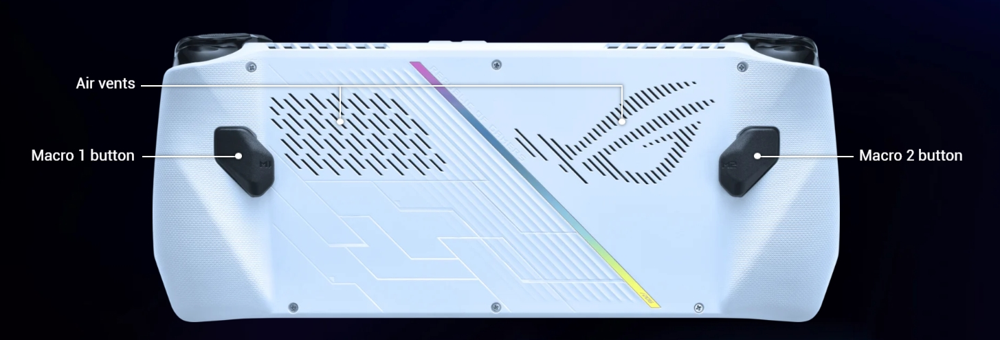
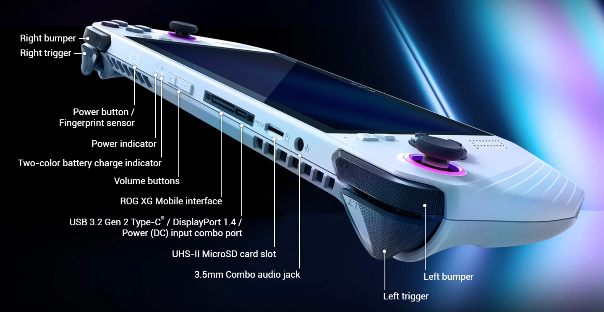
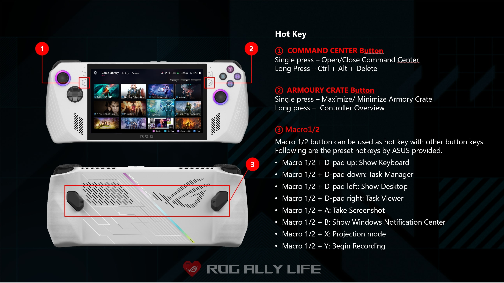
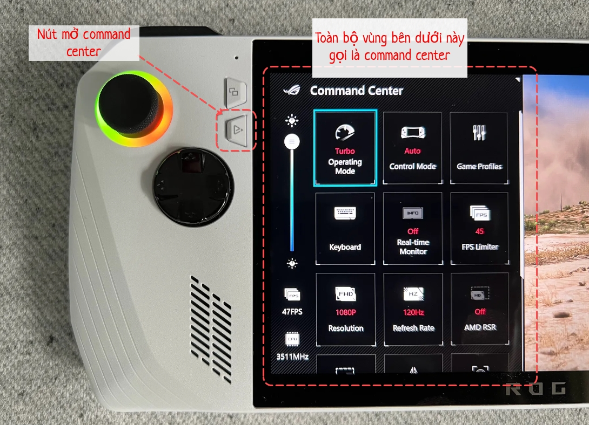
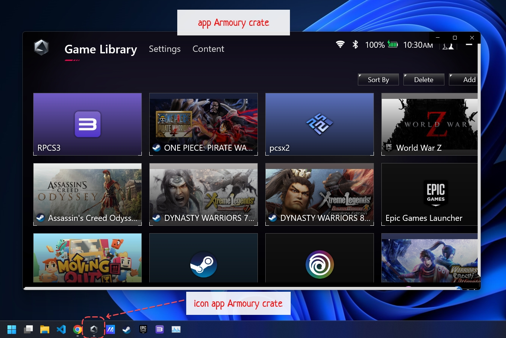
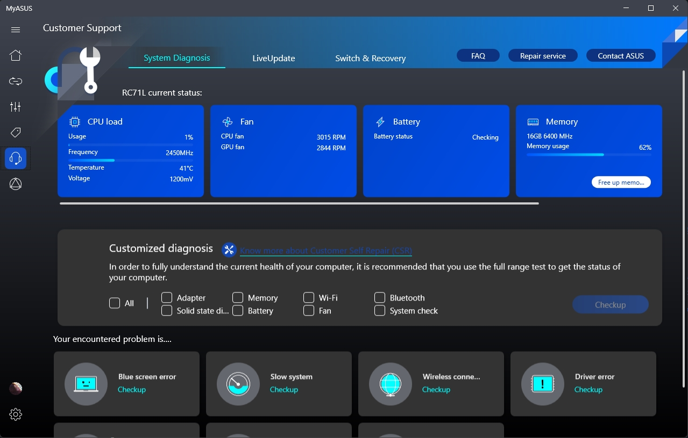
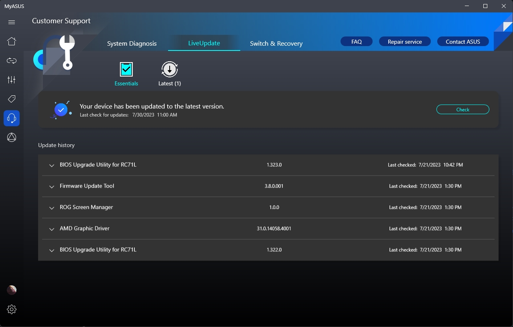

<h1 align="center">
  
   
  Góc nhỏ handheld PC - Asus Rog Ally
</h1>

Một góc nhỏ để mình chia sẽ một số thông tin tìm hiểu được về handheld PC 🎮

# Mục lục

- [Bài viết](#bài-viết)
- [FAQs (giải đáp nhanh)](#faqs)
- [Link tham khảo](#link-tham-khảo)
- [Đôi lời chia sẽ](#đôi-lời-chia-sẽ)

## FAQs (giải đáp nhanh)

#### 1. Tên gọi các nút trên mặt trước Rog Ally

  
Xem nội dung

  
  
  
  

#### 2. Các phím tắt trên Rog Ally

  
Xem nội dung

  
  

#### 3. `Command center` (viết tắt `CC`) là gì?

  
Xem nội dung

  
  Khi bạn bấm phím `Command Center` trên Rog Ally, thì sẽ có một phần mềm trượt từ trái sang phải chiếm 1 phần màn hình bên trái, khu vực này sẽ gọi là `Command Center`

  

  Đây là khu vực giúp bạn có những thiết lập nhanh khi sử dụng máy như: thay đổi tần số quét, mở khu vực hiển thị thống kê CPU/GPU/FPS/nhiệt độ,....

#### 4. `Armoury Crate` (viết tắt `AC`) là gì?

  
Xem nội dung

  
  Khi bạn bấm nút `Armoury Crate` trên Rog Ally (nút có biểu tượng vòng tròn), thì sẽ có một phần mềm hiển thị full màn hình chứa danh sách các game/app đầu tiên.

  

  Đây là phần mềm được cài đặt sẵn trong máy giúp bạn quản lý mọi thứ của Rog Ally. VD: cài đặt nút nhấn, cài đặt danh sách game, cài đặt đèn led của joystick,...

  

#### 5. `My Asus` (viết tắt `MA`) là gì?

  
Xem nội dung

  
  `My Asus` là một phần mềm được cài đặt sẵn trong Rog Ally, phần mềm này giúp bạn quản lý các cài đặt chung của các thiết bị Asus như: **quản lý cập nhật driver** (quan trọng nhất), xem các thông số của thiết bị, check thông tin bảo hành, serial, liên hệ hỗ trợ từ asus,...

  Trong hình bên dưới phần mềm này chính là chỗ mũi tên trỏ tới có icon màu xanh
  
  

  

  Trong hình dưới là mục quan trọng nhất của `My Asus` là mục quản lý các bản cập nhật phần mềm của Rog Ally

  

[⬆️ Về mục lục](#mục-lục)

## Bài viết

### Hướng dẫn

- [Hướng dẫn tắt Turbo Boost của CPU](./asus-rog-ally/huong-dan/huong-dan-tat-turbo-boost-cua-cpu)
- [Cách xem ngày sản xuất máy](./asus-rog-ally/huong-dan/cach-xem-ngay-san-xuat-may)
- [Ẩn biểu tượng thùng rác trên desktop của Windows](./asus-rog-ally/huong-dan/an-bieu-tuong-thung-rac-tren-windows)

### Sửa lỗi

- [Sữa lỗi âm thanh bị rè rè](./asus-rog-ally/sua-loi/sua-loi-am-thanh-bi-re-re)
- [Sữa lỗi không hiển thị các thông tin trên bảng hiển thị thông số CPU, GPU, FPS,...](./asus-rog-ally/sua-loi/sua-loi-khong-hien-thi-cac-thong-tin-tren-bang-hien-thi-thong-so-cpu-gpu-fps)

### Giả lập ps3

- [Hướng dẫn cài đặt giả lập PS3 bằng phần mềm RPCS3](./asus-rog-ally/ps3/huong-dan-cai-dat-gia-lap-ps3)
- [Hướng dẫn cheat game trong giả lập PS3 với phần mềm Cheat Engine](./asus-rog-ally/ps3/huong-dan-cheat-game-trong-gia-lap-ps3-voi-cheat-engine)
- [Config dành cho game Dynasty Warriors: Gundam 3](./asus-rog-ally/ps3/game-dynasty-warriors-gundam-3)
- [Config dành cho game Dynasty Warriors: Gundam Reborn](./asus-rog-ally/ps3/game-dynasty-warriors-gundam-reborn)

### Chia sẽ (vui vẻ, linh tinh,...)
  - [Tiện lợi với handheld PC](./asus-rog-ally/chia-se/tien-loi-voi-handheld-pc)
  - [Dán màn hình bóng hay dán màn hình nhám, lựa chọn nào tốt hơn](./asus-rog-ally/chia-se/dan-man-hinh-bong-hay-dan-man-hinh-nham-lua-chon-nao-tot-hon)
  - [Thử test game Assassin's Creed Odyssey](./asus-rog-ally/chia-se/thu-test-game-assassin-creed-odyssey)
  - [Thử test game Pirate Warriors 4](./asus-rog-ally/chia-se/thu-test-game-pirate-warriors-4)
  - [Thử test game World war z với ultra setting](./asus-rog-ally/chia-se/thu-test-game-world-war-z-voi-ultra-setting)

[⬆️ Về mục lục](#mục-lục)

## Link tham khảo

- Bài viết
  - Hướng dẫn cài đặt quạt và điện năng tiêu thụ cho manual mode - https://allyguide.com/software/best-fan-curves-and-power-profiles-for-the-rog-ally
  - Lỗi không hiển thị các thông tin trên bảng hiển thị thông số CPU, GPU, FPS,... - https://www.reddit.com/r/ROGAlly/comments/148x3fv/real_time_monitor_not_working/
- Game
  - Cấu hình game Red Dead Redemption 2 cho Rog Ally - https://rog.asus.com/articles/rog-ally/red-dead-redemption-2-on-the-rog-ally-performance-guide--best-settings/
- Phần mềm
  - Phần mềm giải nén 7-zip (giải nén được hầu hết các loại file nén) - https://www.7-zip.org

[⬆️ Về mục lục](#mục-lục)

## Đôi lời chia sẽ

- Đây là một git repo mình tạo ra mục đích chính chỉ đơn giản là để chia sẽ các thông tin, kinh nghiệm của mình về handheld PC cụ thể là Rog Ally của Asus, hiện tại phần lớn bài viết đều do mình tự cóp nhặt, dịch, tham khảo, sao chép,... đủ hết. Nếu ai đó gặp vấn đề gì với nội dung mình đăng, rất mong mọi người góp ý và hỗ trợ để mình có thể cập nhập thông tin được đúng đắn nhất cho những bạn đang sử dụng Rog Ally giống mình.

- Xin cảm ơn mọi người 😄!

[⬆️ Về mục lục](#mục-lục)
