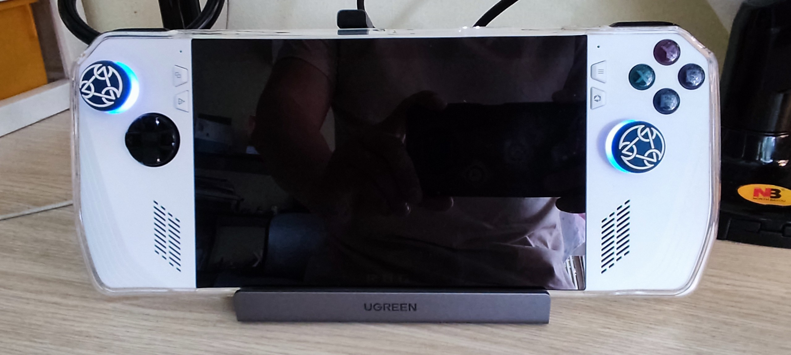
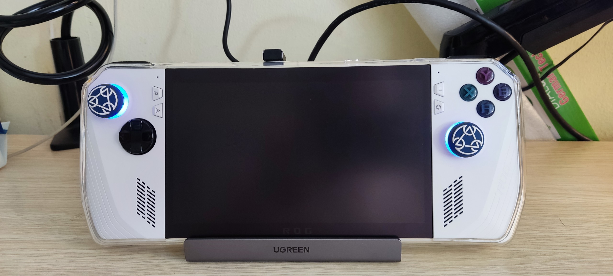

# Dán màn hình bóng hay dán màn hình nhám, lựa chọn nào tốt hơn cho Rog Ally (30/07/2023)

Mình đã sử dụng rất nhiều đồ công nghệ, hầu hết mình đều dán màn hình nhám (kể cả Macbook), tuy nhiên không phải trong bất kỳ tình huống nào thì lựa chọn đó cũng tốt, nên mình muốn dành một bài viết chia sẽ chút cảm nhận của mình đôi với việc lựa chọn dán màn hình bóng hay nhám đối với Rog Ally

Bên dưới là hình mình chụp trong 2 tình huống dán màn hình (xin lỗi vì lúc dán nhám mình đã không bấm focus rõ ràng hình ảnh 😅)

| Dán màn hình bóng  | Dán màn hình nhám |
| ------------- | ------------- |
|   |   |
|   |   |

#### Dán màn hình bóng

- Ưu điểm:
  - Giữ nguyên được chất lượng, độ sáng của màn hình
  - Mua miếng dán cường lực dễ dàng
- Khuyết:
  - Mức độ phản chiếu hình ảnh trên màn hình còn nhiều hơn so với trước khi dán, bởi đơn giản bản thân các màn hình tấm nền gương bây giờ cũng thường sẽ có một lớp phủ chống chói nhẹ rồi
  - Vì màn hình của Rog Ally là cảm ứng nên ta sẽ phải thường xuyên thao tác trên màn hình, việc dán nhám rất dễ để lại dấu tay trên miếng dán (hoặc có loại tốt đỡ bị bám hơn?)

#### Dán màn hình nhám (matte)

- Ưu điểm:
  - Chơi game ở mọi nơi, kể cả nơi có ánh sáng chiếu vào hướng màn hình vào lúc đang ở một khung cảnh game buổi tối hay gì cũng không bị quá khó chịu để nhìn xung quanh. Đặc biệt trong các game kinh dị lại là một điểm cộng
  - Khi cần sử dụng camera ngoài để quay màn hình sẽ không bị nhìn thấy người trên màn hình Rog Ally
  - Có một điểm mà mình không biết các bạn có cùng cảm giác như mình không, nhưng qua nhiều miếng dán nhám từ loại mắc tới rẻ thì cảm nhận chung là mình thấy màn hình sạch sẽ hơn, lau chùi dễ dàng và các bụi bám dễ bay đi hơn ^^, ngoài ra dán nhám ít bị bám dấu tay khi mình chạm vào màn hình hơn dán bóng
- Khuyết điểm:
  - Chất lượng hình ảnh giảm, màu sắc sẽ nhợt nhạt hơn so với dán bóng
  - Độ sáng màn hình sẽ bị giảm. Hiểu đơn giản thì dán nhám để độ sáng 70% sẽ như dán bóng để độ sáng 50% (đây là đánh giá của cá nhân mình)
  - Trên thị trường hiện tại kiếm dán cường lực mà loại dán nhám khá là hiếm, hiện ở VN thì mình tìm ở các nơi dễ mua như lazada, shopee thì chưa có, hiện miếng dán mình dán là loại thường, ra tiệm người ta đo rồi cắt cho chứ không phải loại cường lực

## Kết luận cá nhân

Sau khi sử dụng ở cả 2 tình huống thì cá nhân mình hướng đến lựa chọn dán bóng sẽ tốt hơn:

- Đối với việc sử dụng Rog Ally thì đồng nghĩa ta có thể di chuyển nhiều nơi nó còn dễ dàng hơn cả di chuyển laptop, nên việc tránh các nơi có ánh sáng chiếu trực tiếp vào màn hình rất dễ dàng, thêm nữa là tư thế nằm chơi đa phần của mình là nằm võng, hoặc nằm nềm kê gối lưng -> phần lớn thời gian là màn hình hướng xuống -> vì vậy nên việc dán nhám là không có nhiều giá trị ở trường hợp sử dụng bình thường
- Ngoài ra với khuyết điểm là sẽ làm ảnh hưởng độ sáng màn hình -> nếu cần sử dụng ở nơi nhiều ánh sáng -> sẽ phải tăng độ sáng nhiều lên -> pin hẻo