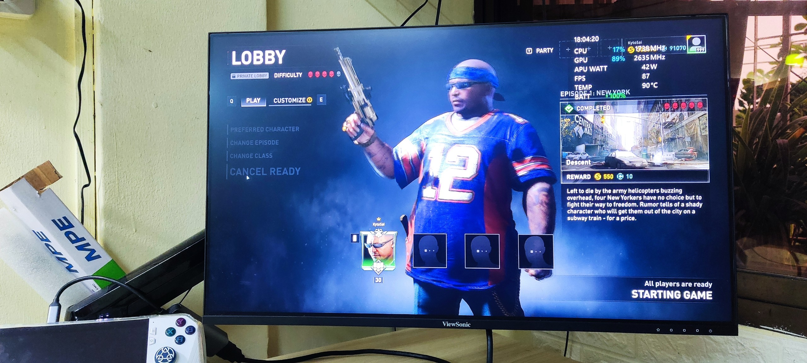
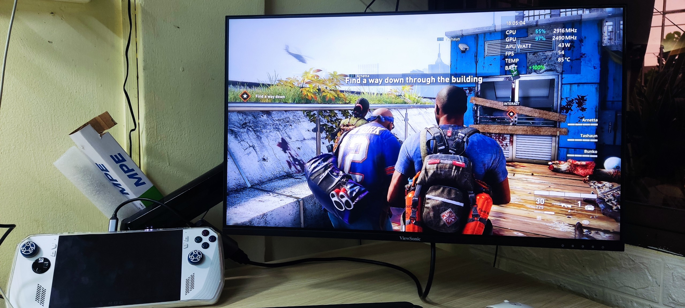
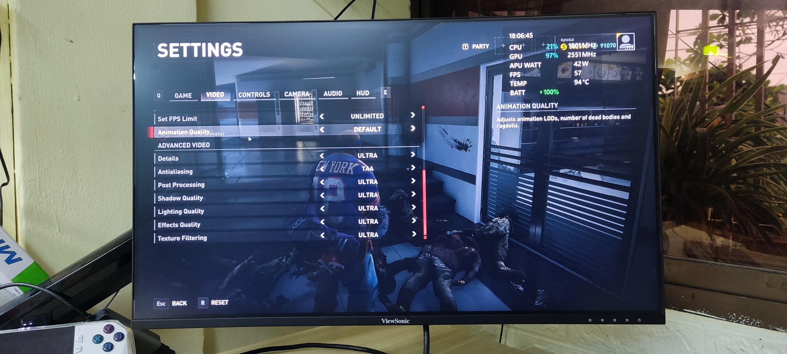
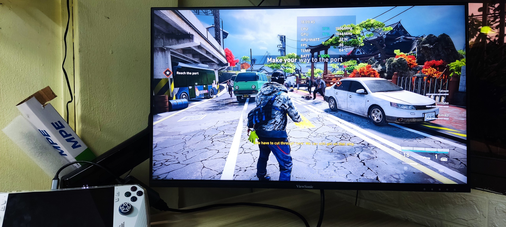
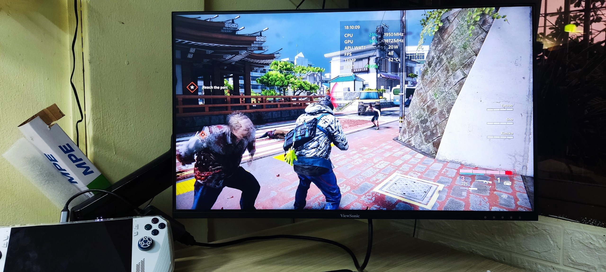
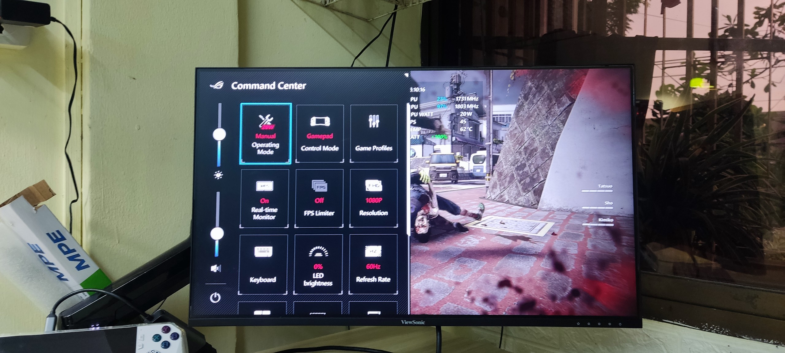
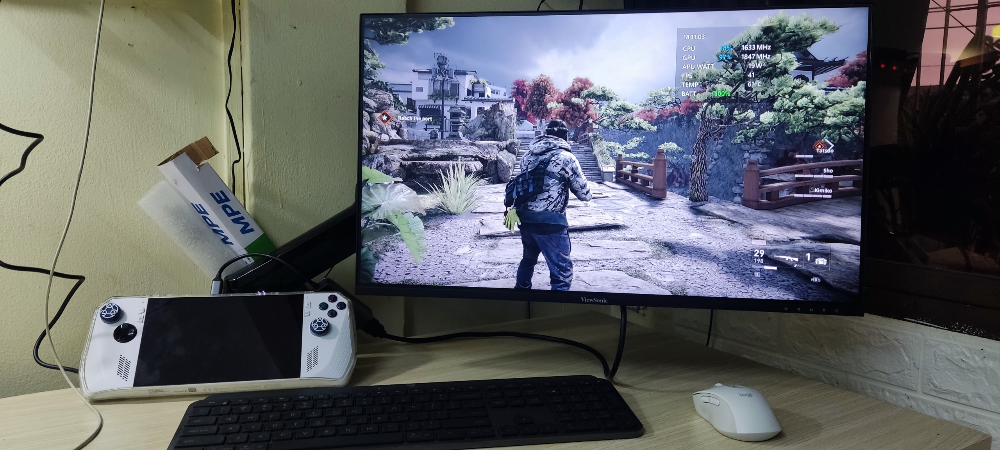

# Thử test game World War Z với Ultra setting (22/07/2023)

Đang cuối tuần, nhân tiện có ông trên voz nhờ test thử nên mở test luôn, qua giờ chỉ test performance mode, bây giờ thử với turbo/manual mode xem sao
Tất cả setup là update bios/asus driver lên mới nhất, tắt cpu turbo boost đi. Test game World war Z

1. Turbo mode 25w (cái củ sạc asus như shit, không đẩy hub lên được 30w)
- Fullhd 1080p, ultra setting, FPS đạt 60, nhiệt 80~95 độ, quạt kêu thì 30db nên cũng không quá ồn, (turbo mode 30w thì quạt lên 35db ồn hơn)
-> mấu chốt là mình đanưg cắm dock/hub nên phạm vi ngồi xa hơn, tương đương laptop -> tiếng ồn sẽ ít bị ảnh hưởng nên cảm thấy êm hơn laptop, nhưng nếu cầm lên chơi thfi 35db thì ồn thật
- Số w bị đẩy lên thừa mứa là 48w -> asus làm cái turbo mode như vậy rất "ngu" vì 30~48w chỉ tổ nóng máy, nếu set cứng 30w thì mát hơn rất nhiều.

2. Manual mode 20w
- Fulhd 1080p, ultra setting, FPS đạt 38~45fps, nhiệt độ 60~70 độ (phần lớn time là 62 độ)
Link hướng dẫn setup manual mode mình sẽ để dưới comment -> mình chỉ set 20w~25w
-> 30w chẳng hơn nhiều FPS ở nhiều game khác nên việc để 30w chỉ tổ nóng máy hơn mà kô giá trị với mình
ư

**TỔNG KẾT:** 

- Nói chung, phải chịu khó tìm hiểu, nếu không chỉ dùng turbo mode của máy thì máy sẽ rất nóng (90 độ), vì bản thân asus làm cái turbo mode là dạng có nhiêu W điện thả ra hết, nhiều người vô tình kô để ý cứ nghĩa nó chỉ là 30w , nhưng thực tế có khi nó đẩy lên 48w, với 48w thì bất kỳ con handheld PC nào cũng lết đến 90 độ đều đều thôi
- Tốt nhất nếu cần 20~30w thì hãy set manual mode. Bạn sẽ bất ngờ về nhiệt độ con này
- Hãy tắt turbo boost của CPU nếu game bạn chơi không chạy 100% CPU thường xuyên và số xung Ghz luôn dưới 3.3Ghz (mức base của 7840U) . Việc này không chỉ có giá trị riêng asus rog ally mà bất kỳ laptop/handheld PC nào mà CPU mạnh thừa thãi đều setup tắt được nha. Mình test trên lenovo legion pro 2023 rồi, rất ổn. 
- Tản nhiệt Rog ally thật sự tốt, tốt hơn SD nhiều, mình không so sánh với các máy khác ngoài SD vì mình chưa sỡ hữu máy khác, chỉ có cơ hội cầm qua chơi sơ nên sẽ không đánh giá, tránh hiểu nhầm
- Cá nhân thì mong chờ asus ra mode 10/15/20/25/30w để tiện cho người dùng hơn