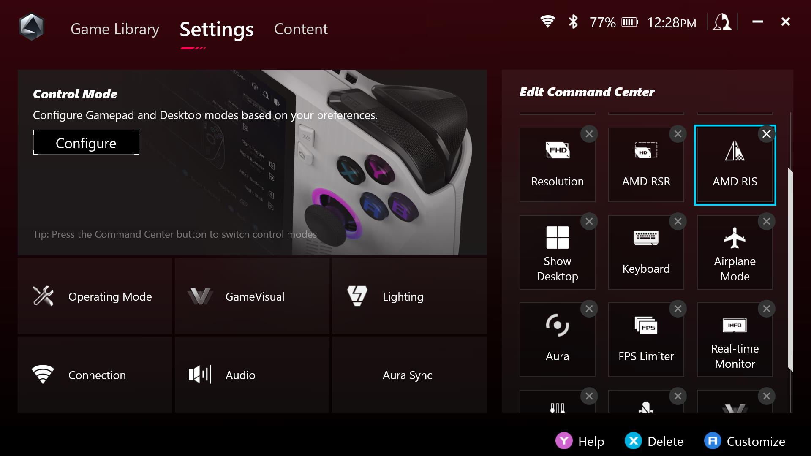
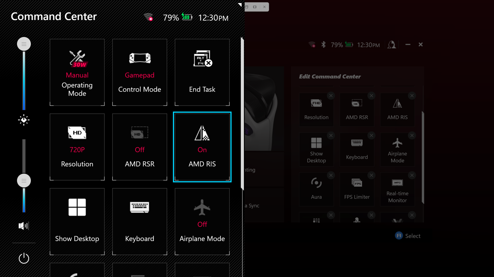
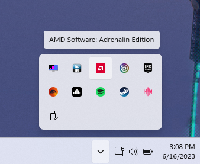
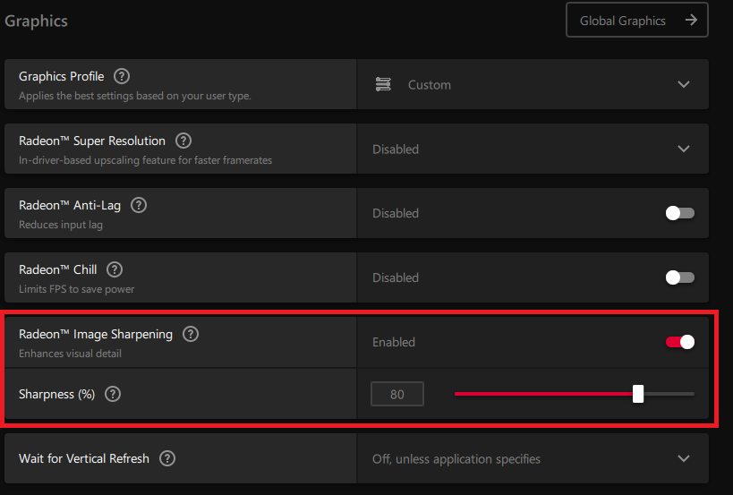

# Hướng dẫn bật tối ưu đồ hoạ bằng công nghệ của AMD là RIS trong Rog Ally (07/09/2023)

## Giới thiệu

- `RIS` (Radeon Image Sharpening) là giải pháp giúp tối ưu hình ảnh khi chơi game được sắt nét hơn của AMD, giải pháp này không làm tiêu tốn nhiều hiệu năng, tuy nhiên hiệu quả sẽ không bằng `FSR`, tuy nhiên đối với màn hình 7in của Rog Ally thì nó vẫn là một lựa chọn tốt
  - Tìm hiểu thêm: https://www.amd.com/en/technologies/radeon-image-sharpening

- Mặc định Rog Ally đã có nút tắt bật nhanh được tính năng RIS này nhưng bị ẩn đi, mình sẽ hướng dẫn các bạn mở tính năng này và sử dụng.

- Bài viết dịch từ bài này: https://rogallylife.com/2023/08/15/900p-1600x900-resolution-rog-ally/#ftoc-heading-2

## Hướng dẫn mở trong Command Center (ưu tiên hơn)

- Bước 1: mở app Armoury Crate chọn tab `settings` nhìn ở cột bên phải chỗ mục `Edit Command Center` và chọn thêm nút `AMD RIS` vào danh sách hiển thị trong Command Center

- Bước 2: mở Command Center lên và bật nút `AMD RIS` thành `On`

- Để chắc chắn lựa chọn này có tác dụng, bạn nên tắt game và mở AMD RIS `On` rồi sau đó mới vào game lại

## Hướng dẫn mở bằng app `AMD Software: Adrenanlin Edition` trong trường hợp cách trên không tác dụng

- Tìm đến app `AMD Software` bằng cách chọn vài icon màu đỏ ở taskbar như trong hình

- Chọn vào tab `Gaming` chọn vào game bạn muốn mở tính năng `AMD RIS` và bật nút gạt ở mục `Radeon Image Sharpening`

- Để chắc chắn lựa chọn này có tác dụng, bạn nên tắt game và mở AMD RIS `On` rồi sau đó mới vào game lại