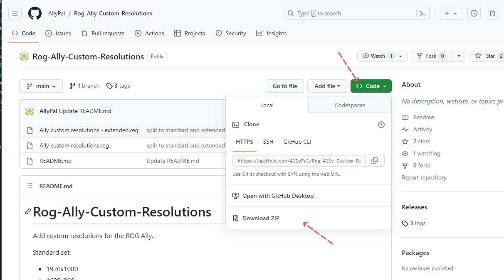
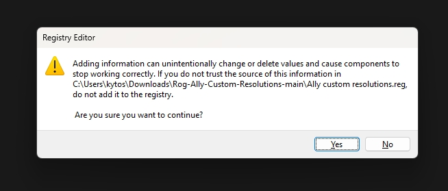
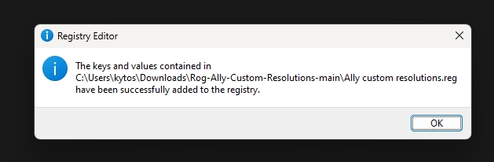
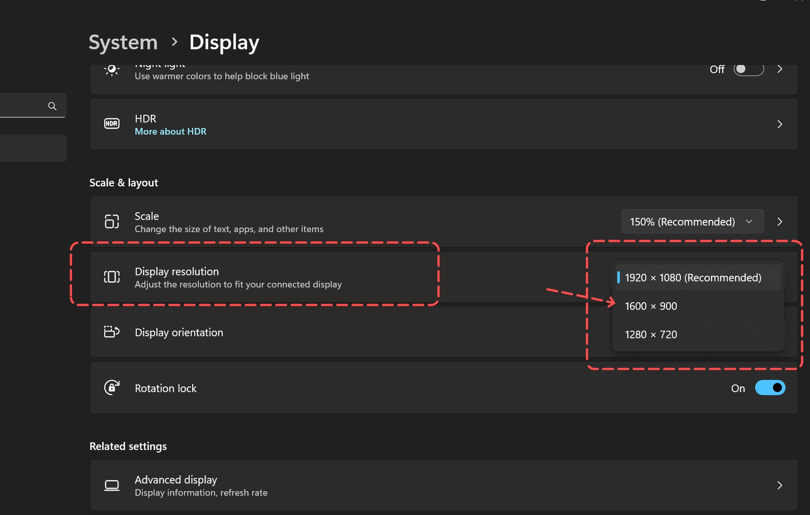

# Hướng dẫn bổ sung thêm nhiều độ phân giải hiển thị cho Rog Ally (20/08/2024)

Mấy hôm nay tự dưng trên reddit thấy dân tình trao đổi về vụ chơi game trên Rog Ally ở độ phân giải `1600 x 900` (gọi tắt là `900p`). Theo như đánh giá của nhiều người thì việc chơi game trên Rog Ally ở độ phân giải 900p sẽ cân đối được giữa độ chi tiết và hiệu năng hơn so với `1280 x 720` (tức `720p`) hoặc `1920 x 1080` (tức `1080p`)

Tuy nhiên mặc định Rog Ally chỉ cung cấp 2 độ phân giải là 720p và 1080p vì vậy để mở thêm độ phân giải `900p` thì ta sẽ cần làm như sau

## Hướng dẫn

- Bước 1: vào trang https://github.com/AllyPal/Rog-Ally-Custom-Resolutions -> bấm vào nút `Code` và nó sẽ xổ một menu xuống -> chọn dòng `Download ZIP` bạn sẽ tải về được một file nén là `Rog-Ally-Custom-Resolutions-main.zip`
  - Nếu tải link trên không được thì bấm [tại đây](https://github.com/kytosai/goc-nho-handheld-pc/raw/main/asus-rog-ally/huong-dan/huong-dan-bo-sung-them-nhieu-do-phan-giai-hien-thi/Rog-Ally-Custom-Resolutions-main.zip) để tải

- Bước 2: giải nén file `Rog-Ally-Custom-Resolutions-main.zip` đã tải về ta sẽ được các file như sau:

- Bước 3: chỉ cần quan tâm file `Ally custom resolutions.reg` -> bấm vào file này nó sẽ hiển thị như hình dưới -> chọn `Yes`

- Bước 4: sau khi chọn `Yes` ở bước trên nó sẽ thông báo như hình dưới có nghĩa là bạn đã thành công

- Bước 5: trên màn hình desktop chuột phải chọn `Display Setting` hoặc vào `Settings` app -> chọn tới mục `Display` sau đó kéo xuống dưới tìm mục `Display resolution` bấm vào cái ô select bạn sẽ thấy lựa chọn `1600 x 900` xuất hiện

**LƯU Ý** nếu vẫn không thấy xuất hiện lựa chọn này thử restart lại windows để kiểm tra lần nữa

## Vài điều cần quan tâm

1. Không cần thiết phải setting độ phân giải màn hình của windows về `900p`, chỉ cần setting trong game nào bạn cần 900p là được
2. Vì bản thân app Armoury Crate của asus chưa có lựa chọn `900p` nên đôi khi sẽ có lỗi nếu bạn sử dụng tính năng đổi độ phân giải từ `Command Center` 
3. Chỉnh về 900p chỉ là giúp tối ưu thêm một ít FPS, đừng trông chờ vào một phép màu giúp FPS tăng đột biến

## Link tham khảo

- Tải file bổ sung độ phân giải: https://github.com/AllyPal/Rog-Ally-Custom-Resolutions
- Video so sánh hiển thị các độ phân giải 720p/900p/1080p trên Rog ally: https://www.youtube.com/watch?v=HuMr8_BXSVA 
- Bài viết trao đổi trên reddit: https://www.reddit.com/r/ROGAlly/comments/15rvtmk/how_good_is_900p_gaming/ 
- Hướng dẫn thêm độ phân giải 900p từ rogallylife: https://rogallylife.com/2023/08/15/900p-1600x900-resolution-rog-ally