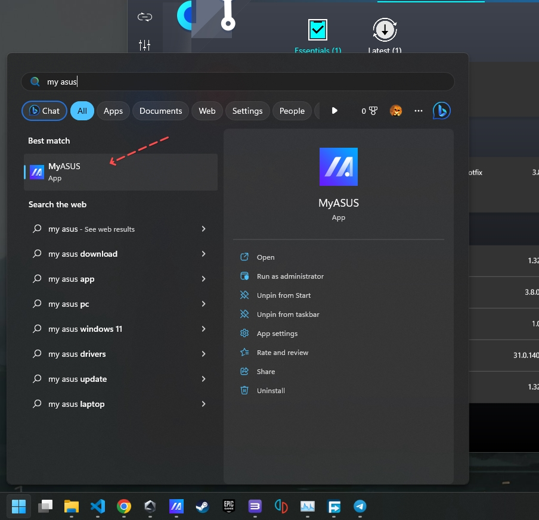
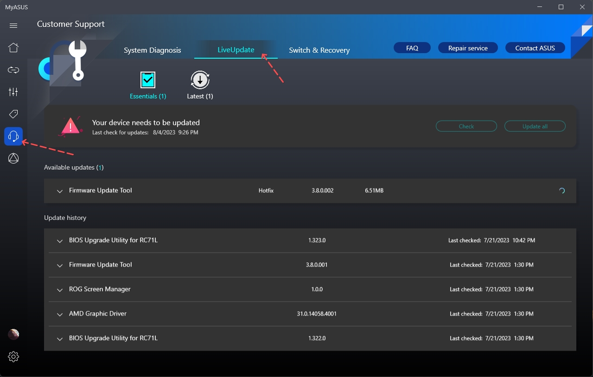

# Hướng dẫn cập nhập phần mềm cho Rog Ally bằng phần mềm My Asus (04/08/2024)

Bước 1: từ start menu của windows gõ `My asus` để tìm kiếm phần mềm `MyASUS`

Bước 2: Sau khi ứng dụng mở lên thì bên cột trái chọn icon hình tai phone -> sau đó ở thanh menu ngang ở trên chọn mục `LiveUpdate` như hình dưới

Bước 3: lúc này ta sẽ ở màn hình quản lý các bản cập nhật phần mềm cho Rog Ally

- Mục `Availabe Update (1)` (số 1 nghĩa là số lượng các bản update đang có) chứa danh sách các bản update đang chờ bạn cài đặt
- Bấm nút `Check` nếu bạn muốn kiểm tra xem có bản cập nhật nào mới không
- Bấm nút `Update All` để cập nhật tất cả các bản cập nhật đang có

## LƯU Ý

1. Luôn luôn cắm điện vào Rog Ally khi tiến hành cập nhật
2. Tuyệt đối không tắt máy trong quá trình cập nhật phần mềm đang diễn ra
3. Tốt nhất là tắt hết các phần mềm đang sử dụng và chỉ để duy nhất phần mềm cập nhật chạy cho đến khi mọi thứ hoàn tất
