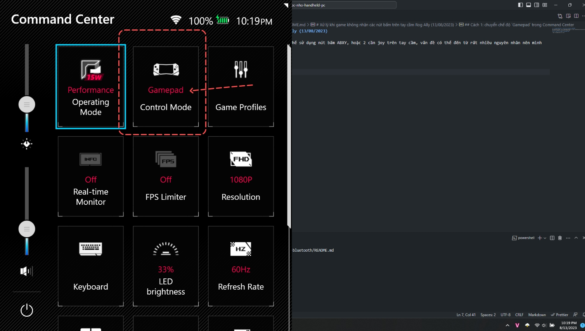
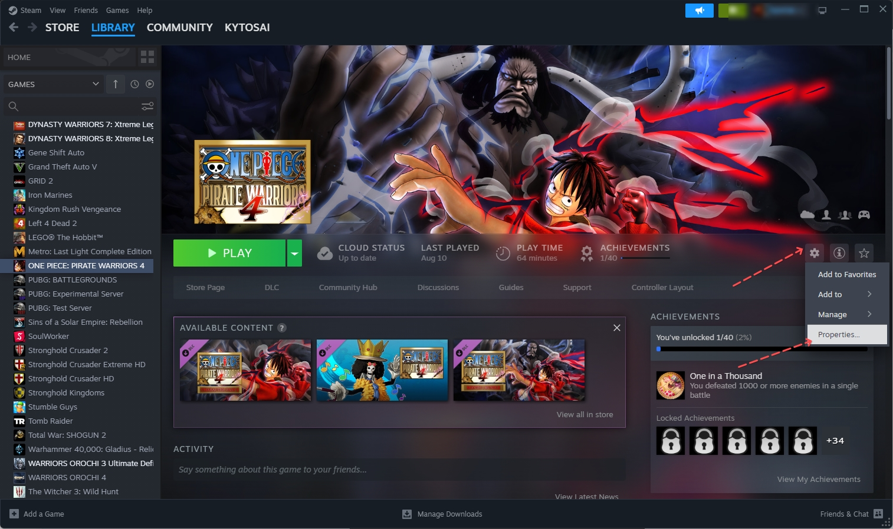
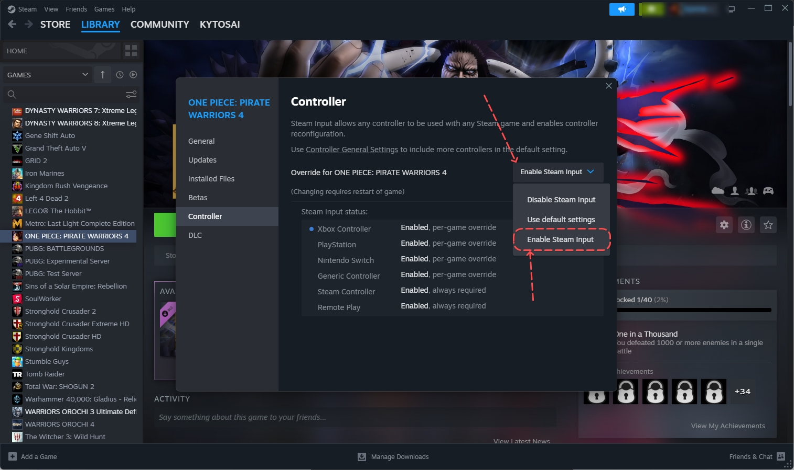

# Xử lý khi game không nhận các nút bấm trên tay cầm Rog Ally (13/08/2023)

Một số bạn gặp tình huống là khi vào game nhưng lại không thể sử dụng nút bấm ABXY, hoặc 2 cần joy trên tay cầm, vấn đề có thể đến từ rất nhiều nguyên nhân nên mình chỉ list ra các phương án mà mình biết để các bạn thử xem.

Nhưng trước khi bắt đầu bạn phải làm một việc là chuyển chế độ `Gamepad` khi vào game 

## Phải chuyển chế độ `Gamepad` trong Command Center khi chơi game

- Đầu tiên là phải vào game -> sau đó mở `Command Center` lên -> tìm đến mục `Control mode` -> bấm vào đó cho đến khi nó hiển thị là `Gamepad` -> thử lại xem đã sử dụng các nút bấm ABXY được chưa
  - Có thể hiểu đơn giản là việc này sẽ giúp cho Rog Ally thông báo tới các game là đã có một tay cầm được kết nối vào rồi -> cụ thể chính là các nút bấm của Rog Ally -> game sẽ nhận diện và sử dụng các nút bấm này

**LƯU Ý:** gần như đây là bước bắt buộc phải làm ở tất cả các game trước khi thử cài đặt gì thêm nếu gặp vấn đề không nhận nút bấm

## Các tình huống và hướng xử lý

### Tình huống: Đối với game của Steam nhưng không nhận tay cầm

- Một số game của steam mình không biết nguyên nhân tại sao lại không nhận tay cầm, dù các game khác vẫn nhận các nút bấm của Rog Ally. Cụ thể một game mình gặp vấn đề là Pirate Warriors 4 trên steam. Cách fix như sau:

- Bước 1: nở steam -> chọn mục `Library` -> chọn game muốn sửa lỗi bên cột trái -> bấm vào -> bấm vào hình biểu tượng bánh răng bên phải -> bấm `Properties`

- Bước 2: cửa sổ popup mở ra giữa màn hình -> bên cột trái chọn `Controller` -> bên cột phải chỗ `Orrerride for XYZ` (XYZ là tên game) -> bấm vào selectbox -> chọn `Enable Steam Input` 

- Bước 3: đóng cửa sổ popup lại -> mở game lên chơi