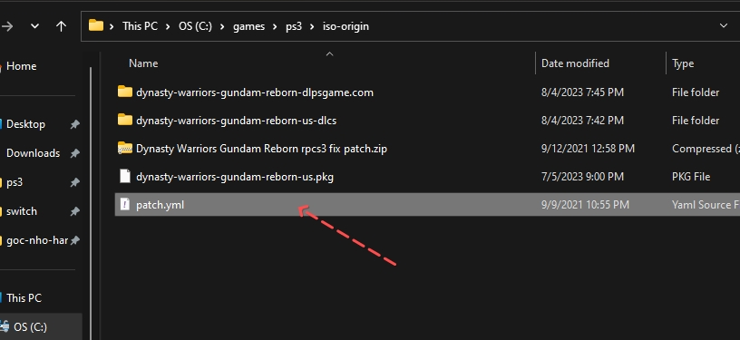
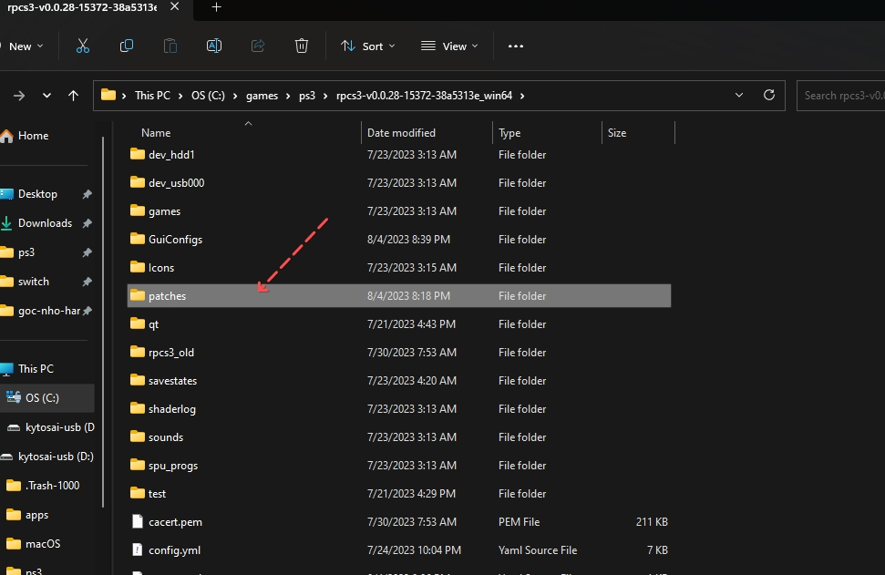
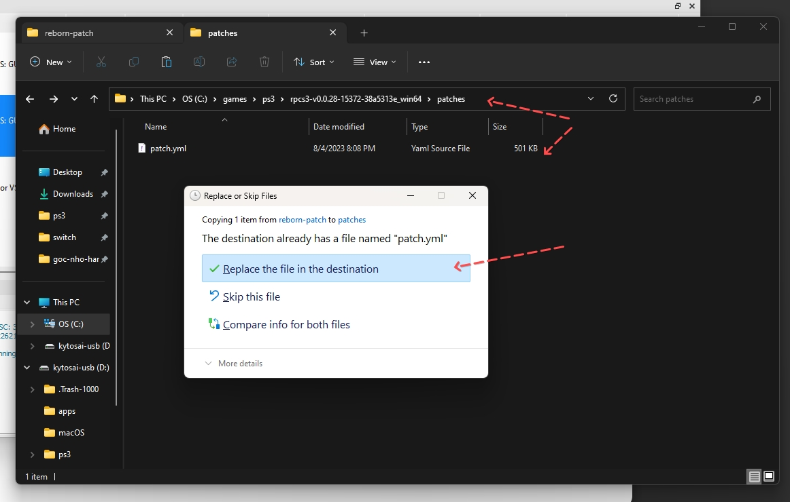
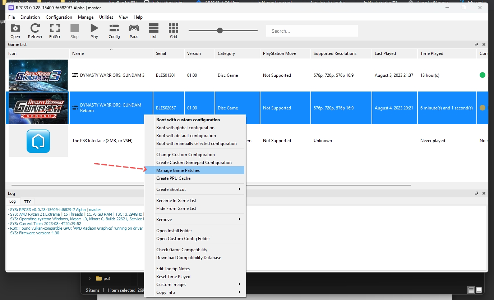
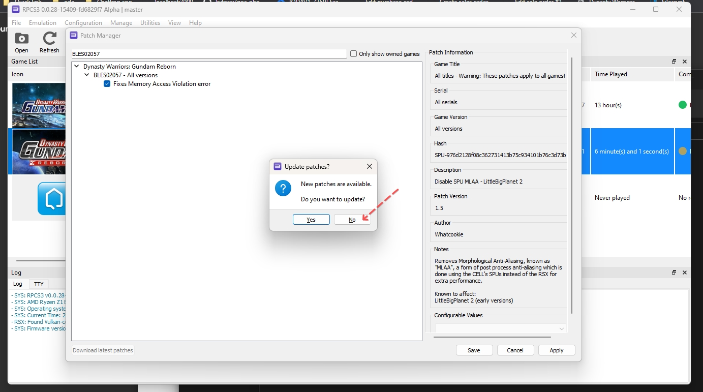
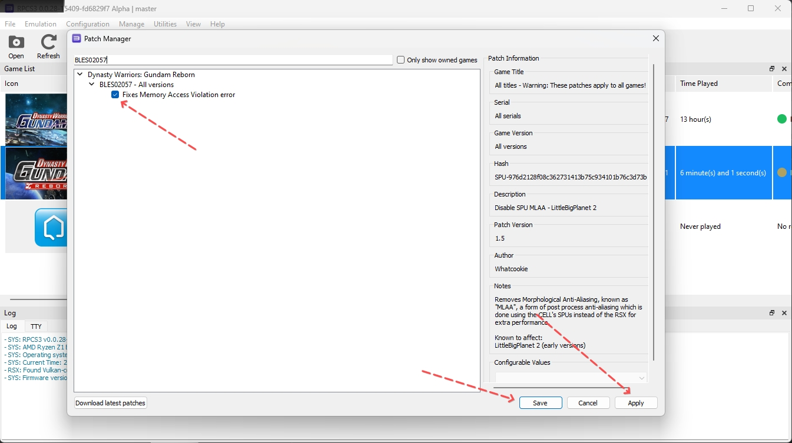

# Game Dynasty Warriors Gundam: Reborn (03/08/2023)

## Thông tin game

- Giới thiệu: https://gundam.fandom.com/wiki/Dynasty_Warriors_Gundam_Reborn
- Video hướng dẫn patch để chơi được game trên RPCS3: https://www.youtube.com/watch?v=8sTOD1VU1sk
- Serial game PS3: `BLES02057`

## Hướng dẫn

- Theo như trên trang danh sách các game tương thích RPCS3 thì DW: Gundam 3 đang ở trạng thái `Ingame` tức là không thể hoàn thành game.
  - Link: https://rpcs3.net/compatibility?g=Dynasty+Warriors%3A+Gundam+reborn#jump
  - Cụ thể khi mình test thì sau khi qua màn hình menu lúc đầu, các video intro thì bắt đầu vào trận chiến thì chỉ có một màn hình đen xuất hiện
- Sau khi tìm hiểu video thì mình thấy video youtube của một anh hướng dẫn cách update patch để có thể chơi được game này

### Bước 1: Tải patch fix bug cho game và đặt đúng folder cần thiết của RPCS3

- Tải patch lại link: 
  - Tải tại đây: 
  - Nếu lỗi tải tại google: https://drive.google.com/file/d/1EZulaPJFj_Ee4aU2CDcIqzmnA1iWbvbT/view

- Sau khi tải về bung nén ra ta sẽ có một file là `patch.yml` tầm 200kb

- Tìm đến folderr `patches` trong thư mục chứa giả lập rpcs3 của bạn

- Bên trong thư mục `patches` nếu bạn đã từng tải patch từ server của rpcs3 thì bạn sẽ có sẵn một file `patch.yml`, còn nếu chưa nó sẽ là folder rỗng. Cẩn thận thì bàn có thể lưu giữ lại file `patch.yml` cũ có sẵn trong đó còn nếu không bạn có thể ghi đè cũng được, vì RPCS3 có cơ chế hỗ trợ tải mới file `patch.yml` này nên không phải lo
  - Đại khái có thể hiểu đơn giản file này chứa các bản vá giúp một số game giả lập PS3 sẽ có thể chơi được

### Bước 2: Load bản patch vào game trong RPCS3

- Mở RPCS3 lên, chuột phải vào game Dynasty Warriors: Gundam Reborn (serial `BLES02057`) -> chọn menu `Manage Game Patches`

- Thường khi mở lên nó sẽ hiển thị một popup yêu cầu bạn cập nhật file `patch.yml` mới nhất từ server của RPCS3 -> bạn phải chọn `No` để giữ lại file `patch.yml` bạn đã tải và ghi đè ở bước 1

- Sau đó nhớ check vào ô `Fixes Memory Access Violation error` -> đó bấm `Apply` -> bấm `Save` để đóng cửa sổ `Patch Manager` lại

### Bước 3:

- Start game và chiến thôi ^^

 