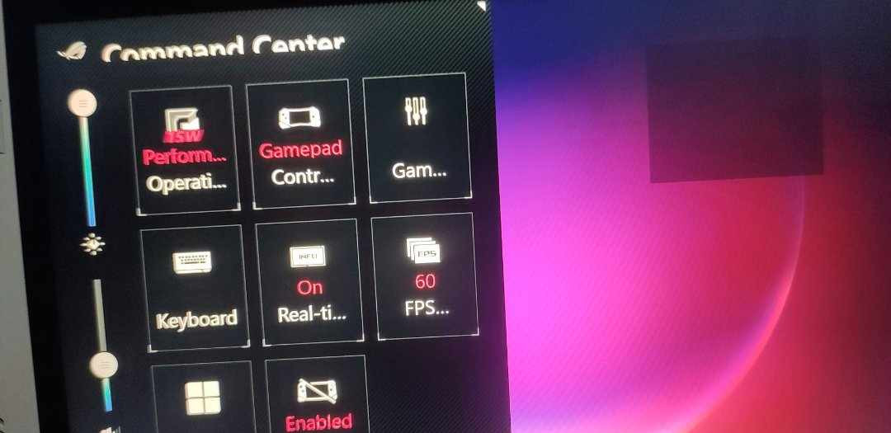
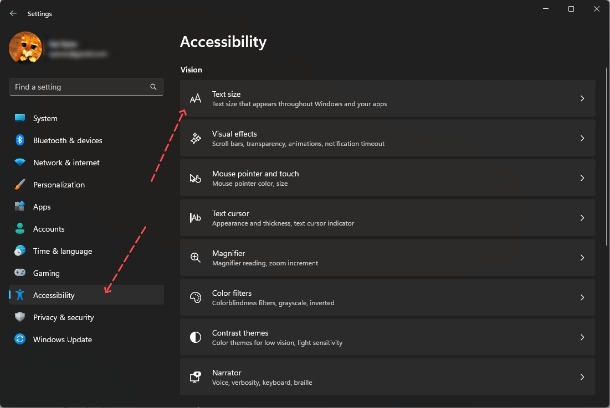

# Sữa lỗi không hiển thị các thông tin trên bảng hiển thị thông số CPU, GPU, FPS,... (25/07/2023)

- Cập nhật (13/08/2023): lỗi này có vẻ đã được fix ở bản update Armoury crate ở thời điểm hiện tại

## Mô tả

- Nếu tình cờ một ngày nào đó Rog Ally của bạn có bị lỗi không hiển thị thông số CPU/GPU/FPS mặc dù đã bật tính năng `Real-time Monitor` từ Command Center như hình dưới

- Nếu bạn gặp vấn đề giống trong hình thì nguyên nhân là do bạn đã setting font size (kích cỡ font) của windows quá lớn, cách fix đơn giản là bạn giảm font-size lại thì mọi thứ sẽ bình thường

## Hướng dẫn

- Bước 1: mở app `Settings` của windows và chọn mục `Accessibility` bên cột trái -> sau đó chọn mục `Text size` bên cột phải

- Bước 2: cái thanh chỉnh font size về 100%, hoặc bạn có thể thử giảm đến mức nào đó ròi bấm `Apply` để kiểm tra lại xem thông số có hiển thị lại không -> đến khi đạt được mục đích là thông số CPU/GPU/FPS... hiển thị bình thường thì giữ nguyên là được

Chúc bạn thành công

### Tham khảo

- https://www.reddit.com/r/ROGAlly/comments/148x3fv/real_time_monitor_not_working/