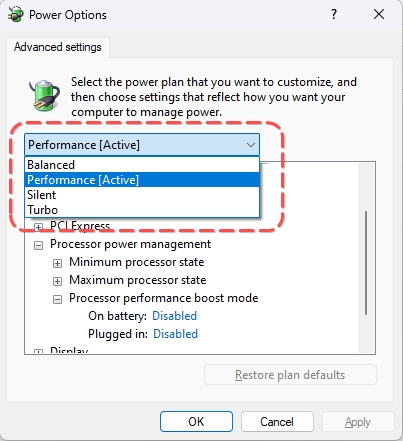

# Cách tắt CPU Turbo Boost cho Rog Ally

## Dạo đầu

- Tắt CPU Turbo boost để làm gì? -> là để tránh CPU đẩy xung lên quá cao (max 5.1Ghz) tắt đi thì max chỉ là 3.3Ghz (mức base của CPU 7840U), nóng máy một cách không cần thiết khi thực tế các game hằng ngày mình chơi đa phần dùng GPU nhiều hơn. Việc tắt đi sẽ có lợi ích là nhiệt máy giảm, tiết kiệm pin, nhiệt giảm thì quạt bớt quay nên bớt ồn ào hơn. 
  - Việc tắt CPU Turbo boost không chỉ có giá trị đối với Rog Ally nói riêng mà còn có giá trị đối với laptop/handheld PC khác những device mà có CPU với số nhân/luồng nhiều và xung base đã khá cao (với mìn thì tầm 3.2Ghz là đủ sài)

- Nhưng trước khi bắt tay làm thì câu hỏi là: nếu ngon vậy thì device nào mình cũng tắt cho sướng đi? 
  - ➡️ Câu trả lời là sẽ tuỳ vào game bạn chơi, có những game ăn CPU rất nhiều, hoặc chạy giả lập PS3 một số game cũng đòi hỏi CPU rất nhiều vì vậy việc tắt Turbo boost vô tình làm giảm FPS của game -> phải biết game mình chơi thế nào để quyết định có nên tắt không, đa phần với mình hiện tại 80% game mình chơi đều không cần bật Turbo boost
  - Một dấu hiệu cơ bản (không phải chính xác hết) để biết nên tắt CPU Turbo boost -> game chạy không hết % của CPU, tức không đạt 80~100% CPU đều đều, ngoài ra cách chính xác nhất là xem feedback từ user từng chơi game hoặc tự test game đó khi bật/tắt luôn là nhanh nhất :D. Setting hướng dẫn bên dưới sẽ có tác dụng liền không phải restart game/win nên test cũng lẹ

- Một số game mình test khi tắt CPU Turbo boost cho mình FPS trước và sau khi tắt trên Rog Ally như nhau là World War Z (ultra setting), Assassin Creed Odyssey/Orgin (medium), giả lập PS3 với RPCS3 (tuỳ game),...

## Hướng dẫn

- Bước 1: tải file `processor_performance_boost_mode.zip` ([tại đây](https://github.com/kytosai/goc-nho-asus-rog-ally/raw/main/bai-viet/cach-tat-turbo-boost-cua-cpu/processor_performance_boost_mode.zip))

- Bước 2: giải nén file .zip trên và ta sẽ có file `processor_performance_boost_mode.reg` file này giúp chúng ta sửa registry của windows tự động thay vì mình phải làm thủ công từng bước trong registry editor -> bấm vào run file này nó sẽ hiển thị thông báo có chắc muốn run không thì cứ `Yes` thôi

- Bước 3: bấm vào ô windows -> gõ `edit power plan` như hình dưới và bấm vào biểu tượng cục pin xanh

- Bước 4: sau đó cửa sổ `Edit power plan` sẽ xuất hiện -> bấm vào `Change advance power setting` 

- Bước 5: lúc này một popup nhỏ là `Power Options` sẽ hiện ra -> trong danh sách các option bên dưới bấm vào `Processor power management` -> bấm vào `Processor performance boost mode` -> chọn `Disabled` cho cả 2 ô `On battery` (dùng pin) và `Plugged in` (cắm sạc) 

- Bước 6: trong ô selectbox có 4 option balanced, performance, silent, turbo (tương ứng với các mode của rog ally), lần lượt chọn từng ô trong selectbox này và thực hiện lại bước 5 -> Sau đó bấm `Ok`

- Bước 7: mở lại các cửa sổ và kiểm tra chắc chắn là các option đã được chọn đúng -> Done