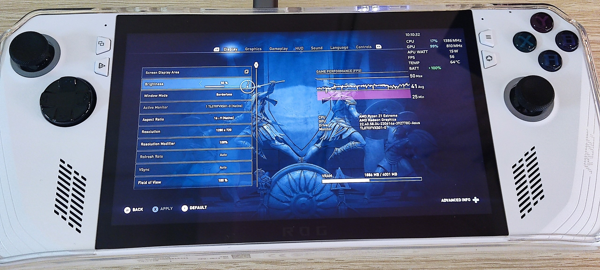

# Thử test game Assassin's Creed Odyssey

Sáng nay (21/07/2023) tải Assassin's Cree Odyssey về test thử với performance mode thì kết quả thu được là:

- Ở 720p + medium setting thì FPS đạt ~40fps ổn định.
- Ở 1080p + medium setting thì FPS đạt 28~35fps ổn định

Thử reset máy lại thì:

- 720p thấy lên được 40~50fps ổn đinh

- 1080p được 35fps~40fps ổn định

Nhiệt độ ổn định ở 60~65 độ, mát rượi, hoàn toàn không nghe tiếng quạt.

Về cơ bản nếu mọi người cần FPS thì cứ để 720p, ở cái mức 7in + chơi game thì 720p với 1080p thì cá nhân mình thấy không khác biệt nhiều. Vì việc nhìn khung cảnh game, khác với nhìn văn bản nên phần nào làm giảm sự khác biệt khó chịu giữa 2 độ phân giải 1 phần.

-> lựa chọn này thì tuỳ gu mỗi người nha, tuỳ sự khó tính và mắt nhìn của mỗi người, không cần tranh luận tốn thời gian việc này, nếu bạn thấy hài lòng với mức res nào thì set mức đó, có những chủ đề tranh luận y hệt về vụ res trên màn 5in (điện thoại), 7in (handheld) đầy rẫy rồi, không cần thiết kéo dài thêm.

Ngoài tất cả các update của Asus + windows thì thứ mình setting thêm duy nhất là disable turbo boost của CPU, với mình thứ này là thừa thải ở các game mình chơi. Một game tạm gọi là cũng thích ăn CPU như Assassin's Creed Odyssey mà vẫn chạy ổn khi tắt thì cứ phè phỡn

**LƯU Ý**: rog ally đang có bug performance mode khi cắm và không cắm sạc thì hiệu năng của nó khác nhau nha, ở bản bios sắp tới 823 (hôm nay sẽ có) thì sẽ fix vụ này. Mình đã thử test thì đúng là có khác biệt thật