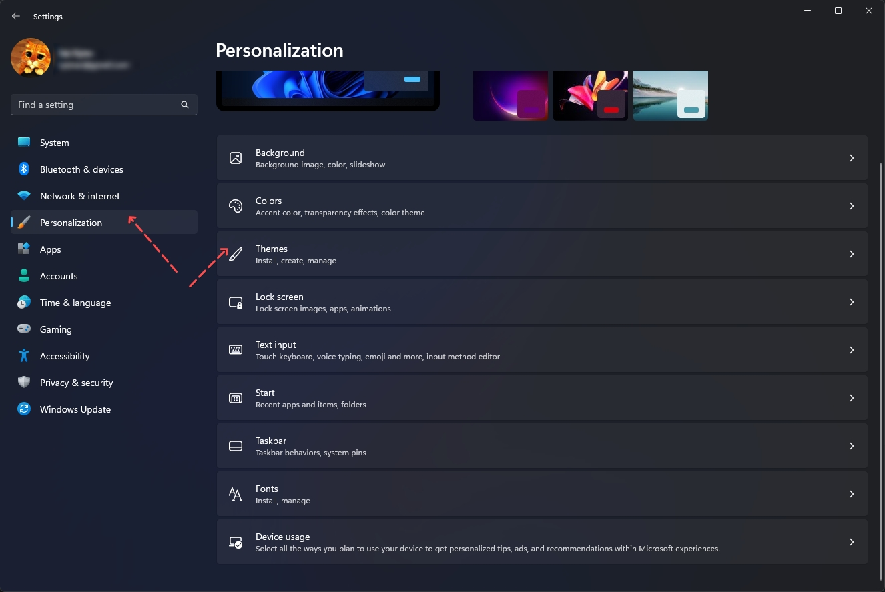
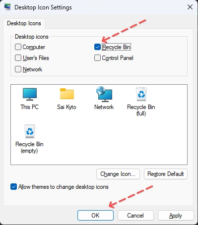

# Ẩn biểu tượng thùng rác trên desktop của Windows 11 

Để màn hình desktop được đẹp hơn thì việc ẩn luôn cái thùng rác vô duyên là chuyện nên làm, nhưng mà để ẩn được nó thì cũng phải tốn vài bước chứ không đơn giản 😎

- Bước 1: Mở app `Setting` trong windows lên -> chọn mục `Personalization` bên tay trái -> chọn mục `Theme` bên tay phải

- Bước 2: Chọn mục `Desktop icon settings` bên tay phải

- Bước 3: Sau đó sẽ có một popup `Desktop Icon Settings` -> bỏ check cái ô `Recycle Bin` -> sau đó bấm `OK` là xong

- Bước 4: ngắm thành quả

