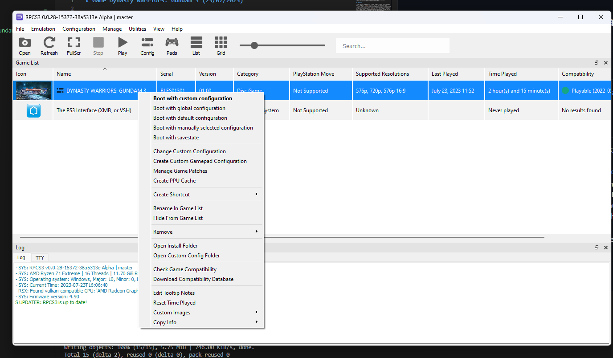

# Game Dynasty Warriors: Gundam 3 (23/07/2023)

## Thông tin game

- Wiki: https://en.wikipedia.org/wiki/Dynasty_Warriors:_Gundam_3
- Chơi trên Rog Ally: https://youtu.be/lT07euLQOU4

## Hướng dẫn:

- Theo như trên trang danh sách các game tương thích RPCS3 thì DW: Gundam 3 đang ở trạng thái `Playable` tức là có thể chơi được hoàn chỉnh game
  - Link: https://rpcs3.net/compatibility?g=Dynasty+Warriors%3A+Gundam+3#jump
- Kiểm tra thêm xem có gì không thì trên RPCS3 cho biết game này không cần config gì đặc biệt để có thể chơi được, tuy nhiên khi mình tiến hành cài đặt và chơi thử thực tế thì mỗi khi bấm nút `Start` thì màn hình của RPCS3 sẽ treo đen thui -> tạch. Sau đó mình có tìm hiểu một số video youtube thì thấy chỉ cần setting thêm 1 option duy nhất để có thể chơi được bình thường
- Cụ thể các bạn chuột phải vào game trong danh sách game -> chọn `Change custom configuration` -> chọn tab `Advance` -> tìm ô checkbox có dòng `liblv2.sprx` check vào -> sau đó `Save custom configuration` -> khi chơi game thì chuột phải vào game chọn `Boot with custom configuration` là xong 😻

Thành quả: 
- Chơi tại performance mode, disable cpu turbo boost, FPS ổn định 50~60fps

