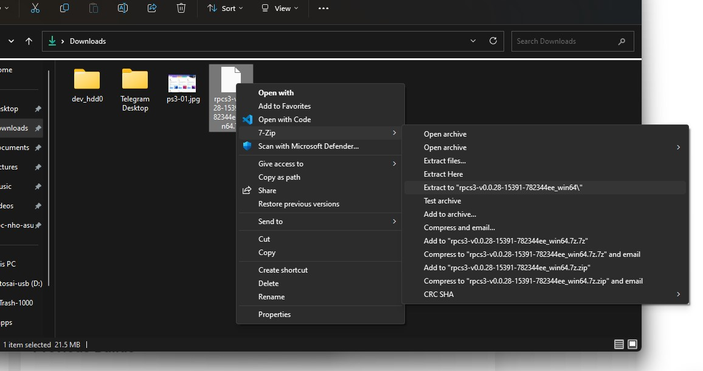
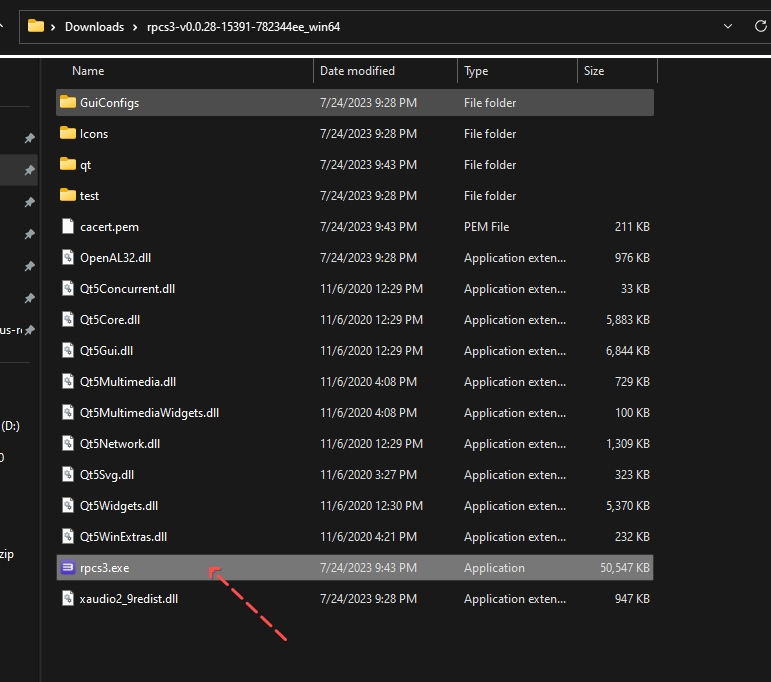
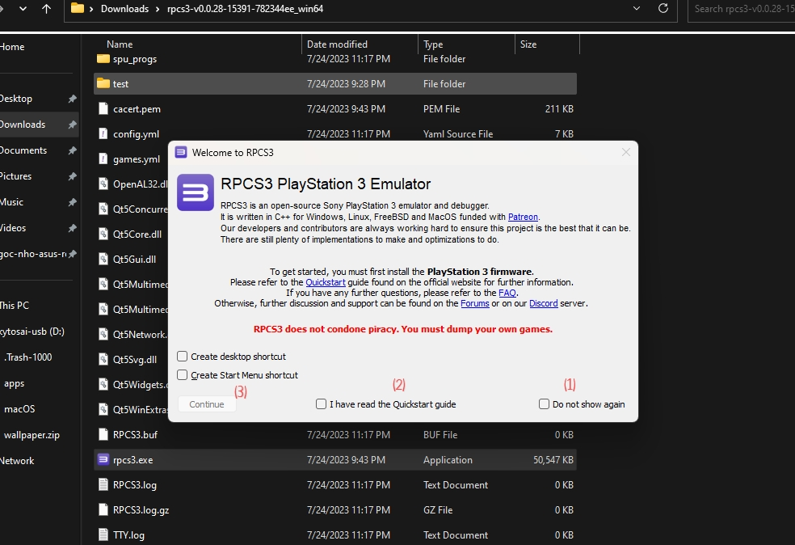
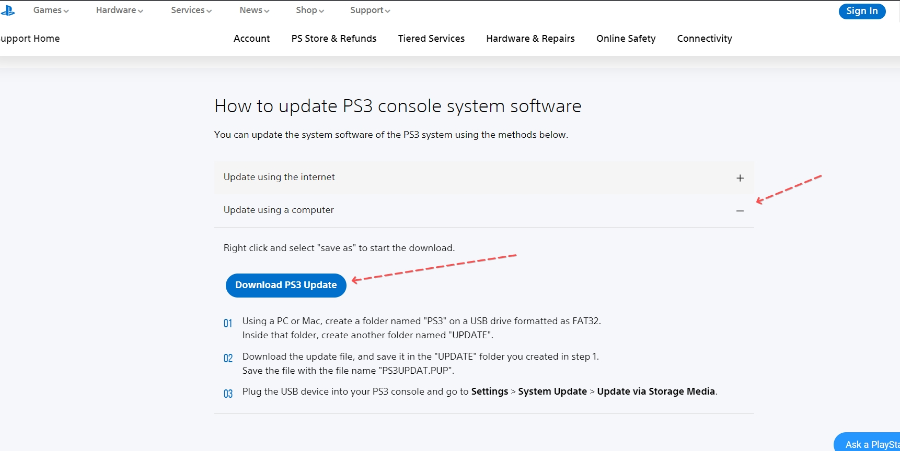
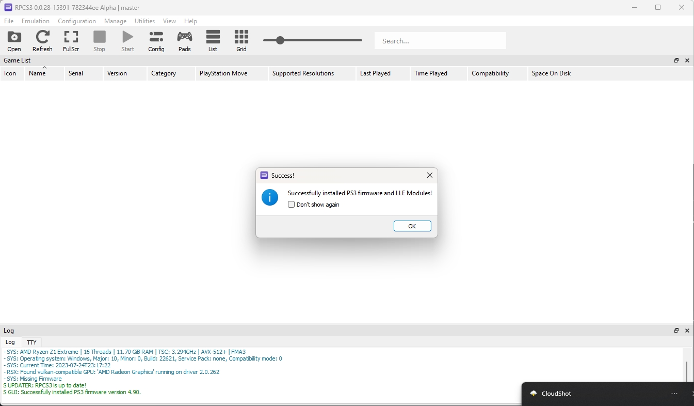
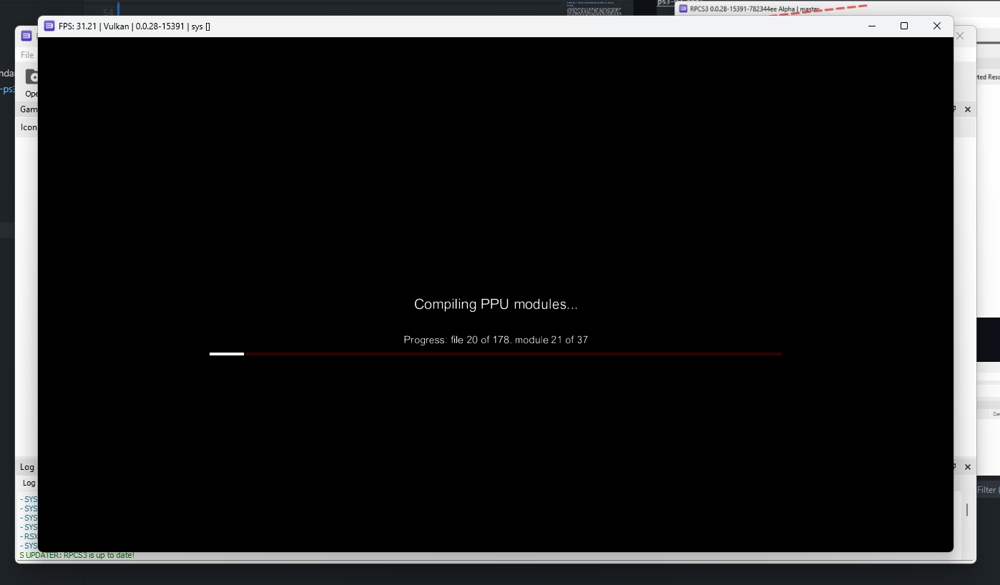
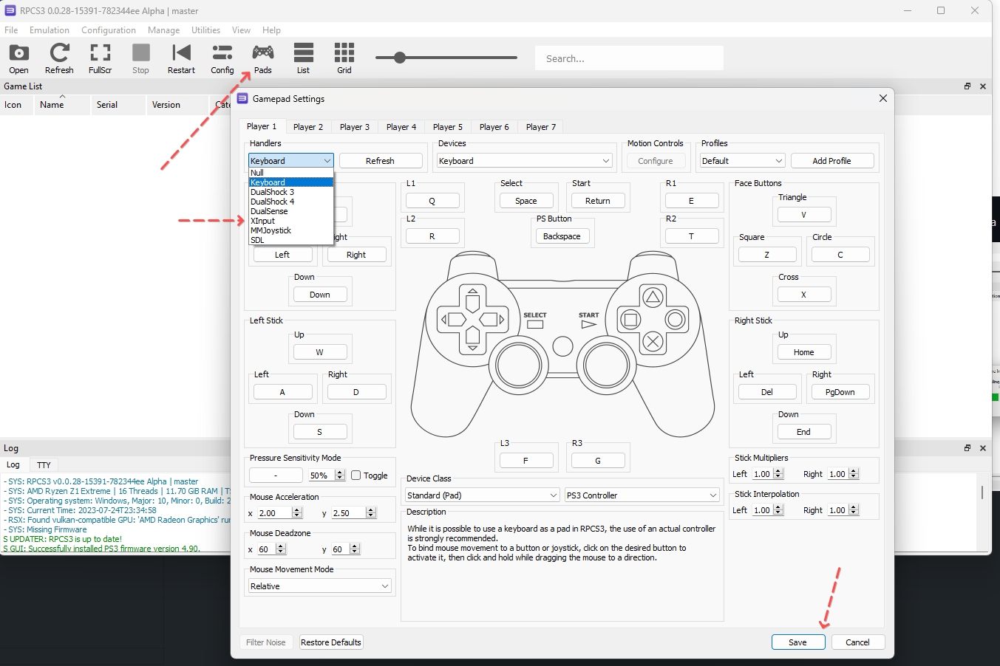
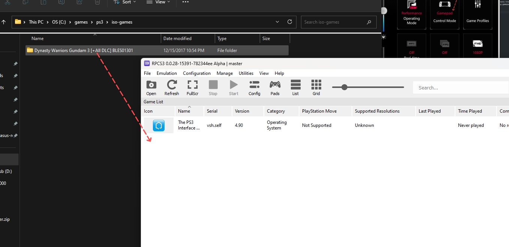
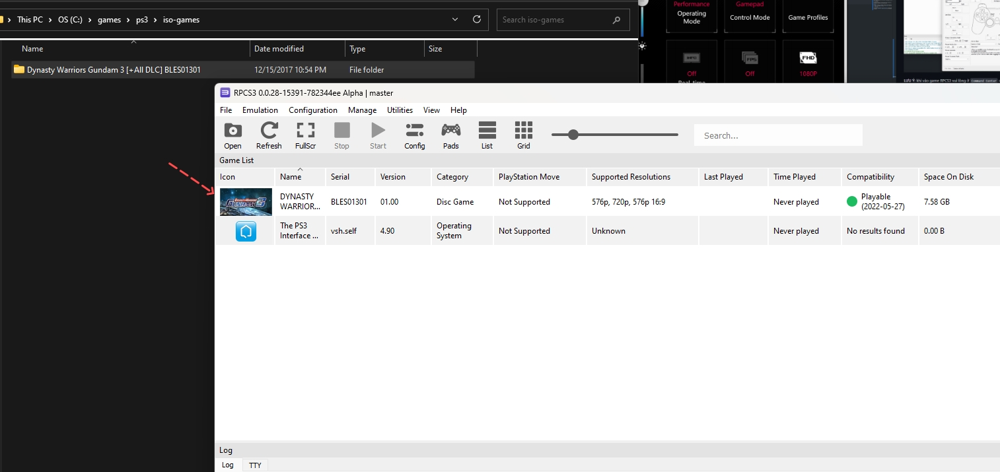
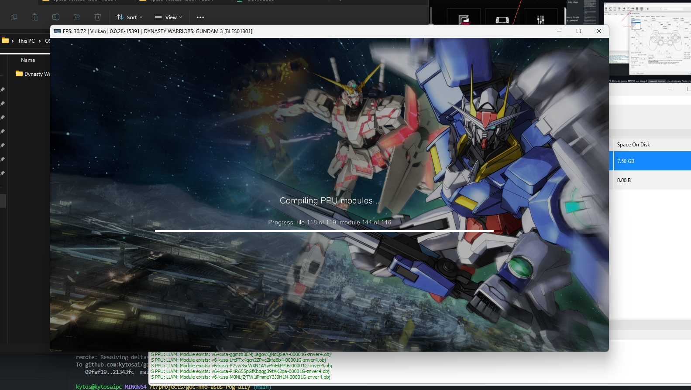

# Hướng dẫn cài đặt giả lập PS3 bằng phần mềm RPCS3 trên Rog Ally

## Mở đầu

- Sau rất rất nhiều năm kể từ khi PS3 ra mắt thì cho đến thời điểm hiện tại, giả lập PS3 vẫn là một cái gì đó rất khoai, trong các team làm giả lập thì trụ đến giờ và làm tốt nhất có lẽ là team làm RPCS3. Tuy thời gian phát triển của RPCS3 đã rất lâu nhưng nếu so với giả lập của PS2 hoặc các hệ máy cũ hơn thì RPCS3 vẫn rất thiếu ổn định trong rất nhiều tựa game, vẫn còn rất nhiều game để có thể chơi được trên RPCS3 ta phải tiến hành custom một số config cho riêng từng game (may mắn là RPCS3 có hỗ trợ cusom config cho riêng từng hệ game và lưu lại config đó). 

- Tốt nhất trước khi xác định bỏ công sức ra cài đặt giả lập PS3 thì bạn nên thử tìm hiểu trước game của bạn trên youtube xem đã có ai giả lập thành công chưa và xem feedback từ phía các gamer xem có vấn đề gì không rồi hãy quyết định có nên tiếp tục cài đặt giả lập RPCS3 hay không.
  - RPCS3 có một trang thống kê các game PS3 đã được họ test là chơi được hay chưa, bạn có thể tìm kiếm trước tại đây: https://rpcs3.net/compatibility 
  - Yên tâm là đã có rất nhiều tựa game nổi tiếng có thể chơi ngon lành trên RPCS3 rồi: God of war 3, persona, redeem redemption,...

- Hướng dẫn của mình cũng chỉ dựa trên hướng dẫn gốc của RPCS3 tại trang: https://rpcs3.net/quickstart và một số video trên youtube. Nếu gặp khó khăn với hướng dẫn bên dưới bạn nên tìm trên youtube để dễ hình dung hơn.

## Hướng dẫn cài đặt RPCS3

### Bước 1: 

Tải RPCS3 mới nhất tại https://rpcs3.net/download . Tìm ô biểu tượng windows và bấm vào `Download` để tải file mới nhất

### Bước 2: 

Sau khi tải file xong ta sẽ được 1 file `.7z` với cái tên kiểu như `rpcs3-v0.0.28-15391-782344ee_win64.7z`. Tiến hành giải nén file này vào môt thư mục
  - Cái tên file sẽ cho ta biết version của nó là `v0.0.28-15391-782344ee` và phiên bản là windows 64 bit -> sau này nếu có báo lỗi thì bạn nên lưu ý phần version này
  - Để giải nén được file `.7z` thì bạn vui lòng cài phần mềm 7-zip tại https://www.7-zip.org/download.html 

### Bước 3: 

Vào thư mục đã giải nén mở file `rpcs3`

### Bước 4: 

Khi mở file `rpcs3` lên ta sẽ được cửa sổ như hình dưới. Làm các bước:
  1. Check vào (1) nếu bạn không muốn cái popup này hiển thị lần nữa
  2. Check vào (2) để đảm bảo bạn đã đọc hướng dẫn sử dụng trước khi dùng để nó cho phép bạn bấm tiếp vào (3)
  3. Sau khi check vào (2) thì bấm vào (3)

Sau đó thì nó sẽ hiển thị cửa sổ app RPCS3

### Bước 5: cài đặt các software cần thiết

Theo yêu cầu từ guide của RPCS3 thì bạn phải tiến hành vào link này https://learn.microsoft.com/en-us/cpp/windows/latest-supported-vc-redist?view=msvc-170#visual-studio-2015-2017-2019-and-2022  -> tìm đến mục `Visual Studio 2015, 2017, 2019, and 2022` -> chọn tải 2 file `vc_redist.x86.exe`, `vc_redist.x64.exe` và tiến hành cài đặt cả 2

### Bước 6: cài đặt firmware PS3

Tiếp theo thì ta phải tiến hành tải firmware của PS3. Bạn vào trang https://www.playstation.com/en-us/support/hardware/ps3/system-software/ -> tìm dòng `Update using a computer` bấm vào để nó hiển thị được cái nút `Download PS3 Update` -> tải file về máy là xong bước này.
  - Thường firmware của PS3 sẽ là file có tên `PS3UPDAT.PUP`
  

### Bước 7: 

Sau khi đã có file firmware ta phải tiến hành import nó vào RPCS3. Mở RPCS3 lên sau đó ở góc trên bên trái chọn `File` -> `Install Firmware` -> nó sẽ show một cửa sổ chọn file, hãy chọn đến file `PS3UPDAT.PUP` đã tải trước đó. Sau đó bấm `OPEN`

Lúc đó cửa sổ nhỏ loading firmware sẽ hiện ra

Sau khi load xong nó sẽ hiển thị cửa sổ báo `Success!` -> bấm Ok

Sau khi bấm Ok nó sẽ nhảy tiếp 1 cửa sổ đen để cài đặt firmware tiếp, cứ chờ đến khi nó xong thôi

Chạy xong nó sẽ tự đóng cái cửa sổ đen lại. Vậy là bạn cơ bản đã xong cái bước setup đơn giản nhất để có thể chơi game với RPCS3

### Bước 8:

Để có thể sử dụng được các nút gamepad của Rog Ally thì bạn cần phải tinh chỉnh một chút là vào mục icon `Pads` ở cái ô chọn `Handlers` bạn hãy chọn là `XInput` -> sau đó bấm `Save` là xong

**LƯU Ý:** khi vào game RPCS3 vui lòng ở `Command Center` của Armoury Crate vui lòng chọn `Control Mode` là `Gamepad` để có thể chơi được bằng gamepad của Rog Ally

## Hướng dẫn thêm game vào chơi

### Bước 1: tải game

Bạn có thể tải file game cho ps3 trên google, hiện tại để tìm kiếm link tải game PS3 bạn phải chịu khó một chút vì rất nhiều game được up từ rất lâu nên link đã không thể sử dụng được nữa

Thường khi tải game PS3 về bạn sẽ được file `.zip`, `.iso` bạn phải bung các file này trở thành một thư mục, bình thường trong một của game PS3 sẽ có các folder/file như sau: `PS3_GAME`, `PS3_UPDATE`, `PS3_DISC.SFB` (hoặc có thể khác nữa vì mình các game mình tải đều như vậy)

Bên dưới là thư mục game Dynasty Warriors Gundam 3 mình tải trên mạng về và bung nén

### Bước 2: thêm game vào RPCS3

Có nhiều cách để có thể thêm game vào RPCS3, cách đơn giản nhất mình hay sử dụng là kéo thả nguyên cái folder game vào trong RPCS3
  - Hoặc bạn có thể bấm vào `File` -> `Add Games` -> chọn folder game muốn add vào RPCS3.

Sau khi thêm thành công ta sẽ được như hình dưới, lúc này ta sẽ có thêm một (hoặc 2 dòng) ta chỉ cần quan tâm dòng có hình đại diện của game thôi

### Bước 3: chơi game

Để tiến hành chơi tựa game đã được thêm vào ta chỉ đơn giản là double click vào dòng game đã thêm trong dnah sách `Game List` là xong ta sẽ thấy nó start như hình dưới

**LƯU Ý:** có những game mình tải về import vào RPCS3 bình thường, nhưng khi ở bước start game này nó lại báo lỗi -> bạn có thể thử tải lại game đó trên một nguồn khác. Cụ thể trong hình là game gundam 3 mình đã phải tải ở 2 trang khác nhau thì ở trang thứ 2 mới hoạt động được dù ở trang đầu tìm thấy nó vẫn import và có ảnh bìa game

## Tổng kết

- Những bước trên chỉ là những bước cơ bản để nhập môn giả lập PS3 và còn kha khá những config bạn phải tìm hiểu thêm như chỉnh độ phân giải của game, chỉnh khử răng cưa, chỉnh vsync, nhưng hẹn nó ở một bài khác nha.
- Như mình đã nói giả lập RPCS3 vẫn chưa hoàn chỉnh, nên sẽ có nhiều tựa game bạn muốn chơi sẽ phải bỏ công sức tìm hiểu cách config một chút để có thể chơi được trọn vẹn game.