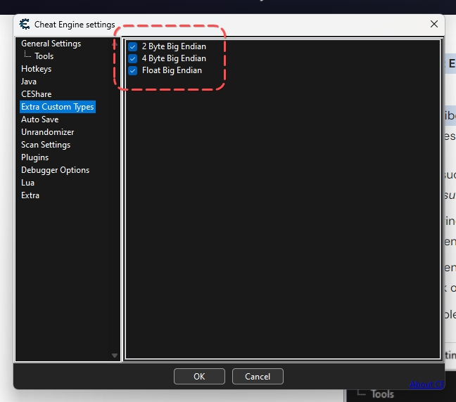
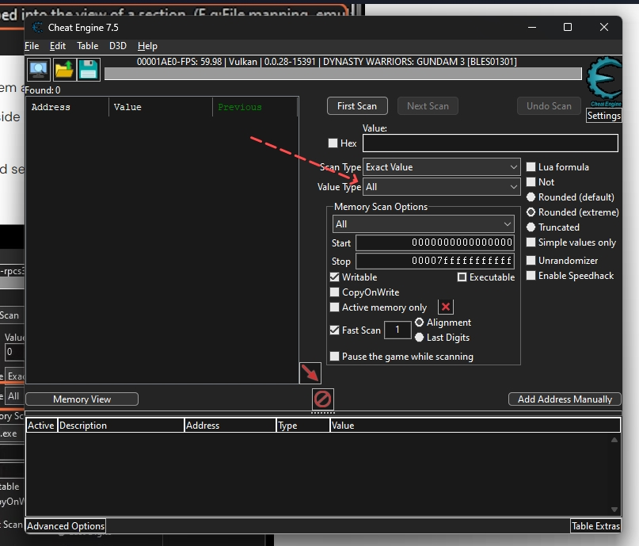

# Hướng dẫn cheat game trong giả lập PS3 với phần mềm Cheat Engine trên Rog Ally (26/07/2023)

- Link phần mềm Cheat Engine: https://www.cheatengine.org/ 

## Mở đầu

- Chắc mọi người không xa lạ gì với Cheat Engine, nó là phần mềm giúp ta hiệu chỉnh được thông số của game offline (hoặc online mà mình không biết). Tuy nhiên Không hiểu sao cách đây tầm cuối năm 2022, mình có thử cheat game trên RPCS3 thì mọi thứ diễn ra rất đơn giản với các cấu hình mặc định của Cheat engine, không hiểu sao ở thời điểm hiện tại đối với version RPCS3 `0.0.28-15391-782344ee Alpha` thì để tìm kết quả cần cheat trong Cheat Engine gần như là không thể. Thứ tìm hiểu khắp nơi thì tìm được một bài hướng dẫn rất dễ hiểu, sau đó làm thử trên tựa game Dynasty Warriors Gundam 3 thì nó lấy được thông số để chỉnh sửa một cách ngon lành, đôi khi là chỉ cần trong 1 lần search là đủ

- Bài viết này sẽ hướng dẫn cách bạn config setting trong Cheat engine để có thể tiến hành tìm kiếm vùng nhớ để chỉnh sửa thông số trong game của giả lập PS3 bằng RPCS3 được, không phải là bài hướng dẫn cách sử dụng Cheat Engine từ đầu vì đã có rất nhiều bài viết trên mạng rồi và phần vì mình không có nhiều thời gian ^^!

## Hướng dẫn Setting

- Bước 1: Chỉnh sửa setting của Cheat Engine. Mở Cheat Engine lên từ menu ngang trên cùng của phần mềm chọn `Edit` -> sau đó chọn `Settings` -> một cửa sổ chứa các cấu hình của Cheat engine hiển thị ra

- Bước 2: Trong cửa sổ `Cheat engine settings` chọn vào mục `Extra Custom Types` bên menu bên trái -> check hết tất cả 3 ô bên tay phải như hình bên dưới, để ta có thể tiến hành tìm kiếm thông số game trên nhiều kiểu dữ liệu khác nữa

- Bước 3: Tiếp tục trong cửa sổ `Cheat engine settings` chọn vào mục `Scan Settings` bên menu bên trái -> check vào ô `All Custom Types` và ô `MEM_MAPPED:Memory that is mapped into the view ò a section...` như hình dưới

- Bước 4: bấm `OK` -> xong phần setting

## Lưu ý khi tiến hành cheat game 

Khi tiến hành cheat game bạn phải đảm bảo 2 việc:

- Việc đầu tiên là ở cửa sổ `Process List` khi chọn tiến trình (process) để cheat, **bạn phải chọn process là cửa sổ đang mở game**. Theo như hình dưới thì nó sẽ là mục `(1)` (là process có chứa tên game, như trong hình là `DYNASTY WARR....`) chứ không phải process `(2)` (là process có chữ `RPCS3...` trong đó) 

- Việc thứ 2 là khi tiến hành tìm kiếm thông số thì option `Value Type` bạn phải chọn `All` để đảm bảo việc tìm kiếm trên nhiều kiểu dữ liệu khác nhau, bao gồm cả các kiểu `Custom type` mà bạn đã làm ở bước setting ở trên

Sau khi đã setting và đảm bảo 2 việc trên thì bạn tiến hành sử dụng Cheat Engine như bình thường. Tuy nhiên việc tìm kiếm vùng nhớ chứa thông số game bây giờ sẽ được **thực hiện rất chậm** nên bạn phải chịu khó đợi nha. 

## Tham khảo

- Liên kết: https://gameskeys.net/how-to-use-cheat-engine-on-rpcs3/ 